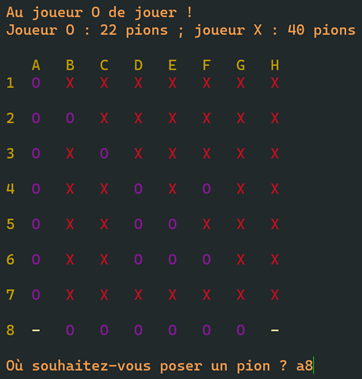

# Cahier des charges

## Contexte

Nous avons réalisé ce jeu pour progresser en algorithmique et en python,
dans le cadre de notre cours de NSI sous la direction de notre
professeur M. Batt.

## Objectif

Le grand objectif de ce projet est de créer un jeu divertissant, mais
aussi pour avoir une bonne note pour augmenter notre moyenne.

## Périmètre

Ce projet s’adresse aux personnes de 7 à 77 ans, mais il est conçu
spécifiquement pour notre professeur de NSI comme cadeau de Noël. Il
peut se jouer à deux joueurs l’un contre l’autre, ou seul contre
l’ordinateur.

## Fonctionnement

Le jeu Reversi se joue à deux joueurs sur un plateau de 64 cases (8 sur
8).

Chacun à leur tour, les joueurs posent un pion de leur couleur sur une
case vide, adjacente à un pion adverse. Chaque pion posé doit
obligatoirement encadrer un ou plusieurs pions adverses avec un autre
pion de sa couleur, déjà placé.

On peut encadrer des pions adverses dans les huit directions et
plusieurs pions peuvent être encadrés dans chaque direction.

Il n’y a pas de réaction en chaîne : les pions retournés ne peuvent pas
servir à en retourner d’autres lors du même tour de jeu.

## Ressources

A notre disposition se trouvent des équipements possédant des
performances limitées (exemple : ordinateur Grand Est), ce qui rendra le
développement plus difficile.

## Budget

Notre budget se limitera à la facture électrique pour le fonctionnement
de nos équipements numériques connectés.

# Description fonctionnelle

Pour coder le jeu du Reversi, nous avons choisi le langage Python, étant
facile à utiliser et s’inscrivant dans notre parcours de NSI. Sa version
3.10 comprend de nouvelles fonctionnalités, messages d’erreur et de
typage de variables, que nous avons mis à profit dans ce projet.

En plus du langage Python de base, nous utiliserons des librairies
officielles préinstallées / à installer séparément :

- os : une interface pour utiliser des fonctionnalités du terminal
  dépendantes du système d’exploitation

- colorama : une librairie externe mettant à disposition des fonctions
  utilitaires et de constantes représentant des couleurs par des
  séquences de caractères

- typing : un module offrant des types de variables supplémentaires

- copy : une librairie permettant de réaliser des copies profondes
  d’objets

- datetime : une librairie permettant de récupérer, formatter et
  stocker les dates et heures

- csv : ce module permet d’interagir plus facilement avec les fichiers
  CSV

Pour un environnement de travail optimisé, nous utiliserons l’éditeur de
texte Neovim avec des modules supplémentaires. Pour la configuration
complète, voir [ce GitHub
Gist](https://gist.github.com/Philou-py/87dbbb1315d8d235244f43bbe440fdd2#file-init-vim).
Afin d’héberger le code source de l’application, nous utiliserons
également GitHub. Le dépôt git créé à cet effet est accessible grâce à
l’URL suivante : <https://github.com/Philou-py/reversi-nsi>

Les interactions avec cette application se feront dans le terminal avec
une interface graphique composée de caractères.

Déroulement de l’application :

1.  L’utilisateur choisi son mode de jeu : soit à deux joueurs, soit
    contre l’ordinateur.

2.  Tant que les 64 cases du plateau ne sont pas remplies, que des pions
    des deux joueurs sont sur le plateau et qu’au moins une case fait
    partie des cases possibles :

    1.  Le plateau de jeu est affiché, sur lequel les cases possibles
        sont mises en avant.

    2.  Un des joueurs entre les coordonnées d’une case.

    3.  Tant que ces coordonnées ne sont pas valides, ou qui ne
        correspondent pas à une case possible, redemander les
        coordonnées.

    4.  Un pion du joueur est posé sur la case dont les coordonnées
        correspondent à celles que le joueur a entrées.

    5.  Le reste du plateau est mis à jour pour retourner les pions du
        joueur adverse acquis par le joueur en prenant en compte toutes
        les directions.

    6.  Le joueur adverse est désigné comme joueur actif.

3.  Le jeu étant terminé, les pions de chaque joueur sont recensés et le
    gagnant est déterminé.

4.  Après avoir enregistré les scores, un classement des parties est
    affiché

# Liste de variables globales et des fonctions

Les différentes variables globales utilisées et leur rôle sont :

- Les constantes:

  - CLEAR_CMD: The command string to clear the screen according to
    the operating system

  - MOVEMENTS: Bi-dimensional tuple describing the coordinate
    offsets for one move in every possible direction

  - OPPOSITE_MOVEMENTS: Bi-dimensional tuple describing the opposite
    movements to those defined in the MOVEMENTS constant

  - WEIGHTING: A bi-dimensional list describing an estimation of the
    worth of each square on the board

- Les types spécifiques à l’application :

  - CoordsType: coordinates

  - MovementType: one movement

  - PlayerSymbolType: the possible player symbols

  - SymbolType: the possible symbols on the board

  - PiecesCountType: statistics dictionary about the number of
    pieces of each player and the total pieces placed on the board

  - BoardType: the type describing the representation of the game
    board

Les fonctions de l’applications sont les suivantes (se référer à la
docstring dans le code pour la documentation complète de chaque
fonction). Pour une meilleure lisibilité et réutilisabilité, leur taille
se limite pour la plupart à 20 lignes.

- Les fonctions utilitaires (utilisées dans les fonctions concrètes) :

  - clear_screen: erases terminal screen (regardless of the OS).

  - update_coords: computes the coordinates of the square positioned
    relatively to the original one thanks to the provided direction.

  - get_other_player: gets the symbol of the other player.

  - can_use_mov: checks if the cursor movement can be applied,
    considering the coordinates of the current square and the edges
    of the board.

  - get_opposite_mov: gets the opposite movement of the one passed
    as first argument, using the OPPOSITE_MOVEMENTS constant as
    reference.

- Les fonctions concrètes :

  - print_game: prints the playing board with characters, line by
    line.

  - get_input: asks the user to enter the coordinates (with a letter
    and a number) of the square to place the piece on. Retries while
    the user input format isn’t correct and while the square is not
    in the list of possible moves (if provided).

  - count_surrounding_squares: counts the number of squares that can
    be gained by the current player in one direction by placing a
    piece on a certain square.

  - get_closest_other_piece: fetches the closest piece according to
    one direction different from the symbol given as first argument.

  - would_be_stable: determines if a square would be stable if a
    piece was placed onto it. A square is considered to be stable if
    it can't be taken by the other player at the next move.

  - count_pieces: calculates the number of pieces of each player.

  - get_possible_moves: computes the list of available squares for a
    player.

  - update_board: updates the game board after a player has placed a
    piece in a certain square.

  - compute_score: computes the score of the given square if the
    player placed a piece on it, thanks to three strategies:
    positional strategy, stable pieces strategy and a blocking
    strategy for the player after.

  - get_computer_move: computes the best move, by establishing a
    score for each possible move.

  - show_table: prints out a table of scores for a particular player
    containing rows corresponding to the following fields: the ID of
    the game, the opponent, the date / time, whether the game was
    won, the number of pieces of the player and the number of
    opponent pieces.

  - show_stats: reads the \`scores.csv\` file, filter and sort the
    data in order to show the results and ranks the games played by
    a particular player.

  - save_results: asks the user for the name(s) of the player(s) and
    saves the results of a game to the \`scores.csv\` file.

  - handle_game_over: handles the end of a game, prints out the
    winner and statistics compares the game to the others saved in
    the \`scores.csv\` file.

# Présentation de l’interface utilisateur

Présentation du jeu, explication des règles et choix du mode de jeu :

Plateau de jeu (avec le joueur, les statistiques) :

Les pions des joueurs sont représentés par des lettres : O pour le
joueur 1 et X pour le joueur 2 (ou l’ordinateur).

Un tiret signifie qu’une case est vide ; il est en jaune clair / blanc
si cette case est un mouvement autorisé pour le joueur.

Le dernier pion posé par un joueur est surligné avec sa couleur.

Lorsque le jeu est fini, le joueur gagnant ainsi que le nombre de pions de
chaque joueur est affiché :

Le joueur peut choisir d’enregistrer ou non les résultats de sa partie.
Pour cela, le nom du joueur / des joueurs est demandé. Si oui, un
classement de la partie parmi les autres réalisées pour chaque joueur
est affiché sous forme d’un tableau :

 

# Tests et validation

<table>
<colgroup>
<col style="width: 19%" />
<col style="width: 17%" />
<col style="width: 46%" />
<col style="width: 16%" />
</colgroup>
<thead>
<tr class="header">
<th><strong>Cas testé</strong></th>
<th><strong>Donnée fournie</strong></th>
<th><strong>Résultat attendu</strong></th>
<th><strong>Test passé (et résultat obtenu sinon)</strong></th>
</tr>
</thead>
<tbody>
<tr class="odd">
<td>Un joueur entre des coordonnées sous un mauvais format.</td>
<td>3e puis 35</td>
<td>Le programme redemande à l’utilisateur :

</td>
<td>Oui</td>
</tr>
<tr class="even">
<td>Un joueur entre des coordonnées d’une case non autorisée par les
règles du jeu.</td>
<td>Au premier tour : A1 puis A2</td>
<td>
Le programme redemande à l’utilisateur :

</td>
<td>Oui</td>
</tr>
<tr class="odd">
<td>Un joueur disparaît du jeu.</td>
<td>C5 (ce cas spécifique ne pourrait pas se produire lors d’une vraie
partie)</td>
<td>
Le jeu se termine et affiche le gagnant :

</td>
<td>Oui</td>
</tr>
<tr class="even">
<td>Un joueur (dans ce cas, le joueur X) ne peut pas jouer à son
tour.</td>
<td>H8</td>
<td>
Tour du joueur d’avant :

Le joueur O joue en A8. Le tour du joueur X est sauté, car il ne peut
pas placer de pion en H8 :

</td>
<td>Oui</td>
</tr>
<tr class="odd">
<td>L’utilisateur ne possède pas de fichier `scores.csv`</td>
<td></td>
<td>Création du fichier avec les bons entêtes.</td>
<td>Oui</td>
</tr>
</tbody>
</table>

Partie de Reversi : mon programme python contre l’intelligence artificielle du
reversi en ligne <https://reversi.zone> en mode difficile : Mon
programme gagne !

A gauche, le jeu du programme python est représenté par les pions X, et
celui du reversi en ligne par les O. A droite, les blancs sont des pions
du programme python et les noirs ceux du programme du site web.

 

 

# Bilan du projet et personnel

En conclusion, nous avons réussi à programmer le jeu pour qu’un joueur
contre l’ordinateur ou deux joueurs puissent mener une partie de Reversi
jusqu’à la fin.

En tant que novice au Reversi, la plus grande difficulté de ce projet a
été de trouver les bonnes stratégies pour implémenter un jeu de
l’ordinateur assez efficace, qui fait la plupart du temps des bons
choix. Le site <http://www.samsoft.org.uk/reversi/strategy.htm> a été
une grande aide pour mieux comprendre ce jeu.

Une extension possible de cette implémentation du Reversi serait la
création d’une API qu’une interface web utiliserait, ce qui améliorerait
considérablement l’expérience utilisateur.

Ce projet m’a permis de me familiariser avec la documentation du code et
des fonctions, ainsi que la nécessité d’écrire des commentaires. De
plus, j’ai appris comment ajouter des couleurs à la sortie du terminal
grâce à la librairie colorama, et comment interagir avec les commandes
du terminal en fonction de chaque système d’exploitation avec le module
os de python.

Si je devais réaliser un projet similaire, je prendrais soin de marquer
des étapes dans la création du code et effectuer plus régulièrement des
commits, afin de pouvoir à tout moment retrouver une version de
l’application fonctionnelle, en cas de perte du code ou de bug.
